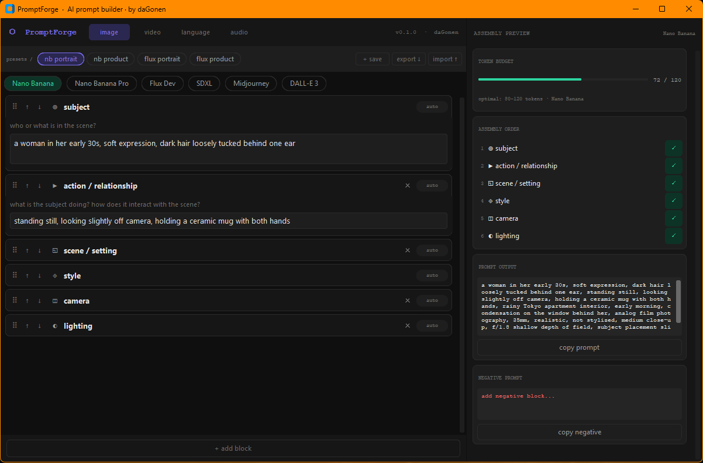

# ⬡ PromptForge

**AI Prompt Builder — by daGonen**

> Stop staring at the blank prompt box. Build better prompts, faster.

PromptForge is a structured, block-based prompt builder for AI image, video, language, and audio models. Fill in focused fields — subject, style, mood, lighting, camera, motion, audio — and PromptForge assembles the optimal prompt for your target model, handling token ordering, weight syntax, and token budget automatically.

Built for creators, AI artists, and power users who work across multiple models and modalities.

---



---

## Features

- **Block-based prompt building** — modular fields for every aspect of your prompt. Add, remove, drag to reorder, or use ↑↓ arrows.
- **Model-aware assembly** — each model has its own assembly order, token budget, and weight syntax baked in.
- **Weight syntax** — emphasis sliders appear only on models that support it. SDXL outputs `(word:1.4)`, Midjourney outputs `word::2`. Flux, Nano Banana, Veo 3 ignore weights and output clean text.
- **Token budget bar** — live token count with model-specific optimal range. Green → amber → red.
- **4 modality tabs** — Image, Video, Language, Audio — each with their own block sets and model list.
- **Preset system** — save your full working state as a named preset. Load in one click. Double-click to delete.
- **Export / import presets** — save presets as `.json` and share or back them up.
- **Order guardrails** — an amber warning bar appears whenever your block order differs from the model's recommendation. Shows recommended vs your order side by side, highlights the misplaced blocks, and offers a one-click `↺ reset order` to restore model-preferred sequence. Every deviation is caught, even one-step changes.
- **Priority override** — click the `auto` badge on any block to pin it to a specific assembly position. A `↺` reset button appears when overridden. Manual overrides are excluded from order warnings.
- **Separate negative prompt** — assembled and copied independently.

---

## Supported Models

### Image

| Model | Key | Token Budget | Weight Syntax |
|-------|-----|-------------|---------------|
| **Nano Banana** | `nano` | 120 | none — natural language |
| **Nano Banana Pro** | `nanopro` | 150 | none — natural language |
| Flux Dev | `flux` | 75 | none |
| SDXL | `sdxl` | 77 | `(word:1.4)` |
| Midjourney | `mj` | 60 | `word::2` |
| DALL-E 3 | `dalle` | 90 | none |

### Video

| Model | Key | Token Budget | Notes |
|-------|-----|-------------|-------|
| **Veo 3** | `veo3` | 120 | Native audio — use the audio block |
| **Veo 3.1** | `veo31` | 120 | Improved I2V, stronger prompt adherence |
| WAN 2.1 | `wan21` | 80 | |
| WAN 2.2 | `wan22` | 80 | |
| Kling | `kling` | 60 | |
| LTX | `ltx` | 70 | |

### Language

| Model | Token Budget |
|-------|-------------|
| Claude | 200 |
| GPT-4 | 200 |
| Gemini | 200 |
| Llama 3 | 180 |

### Audio

| Model | Token Budget |
|-------|-------------|
| ElevenLabs | 100 |
| Suno | 80 |
| Udio | 80 |

---

## How Weight Syntax Works

Emphasis sliders are only shown when the selected model supports weight syntax. At exactly 1.0 the text is always output plain. Above 1.05 the syntax is applied:

| Model | Slider 1.4 | Slider 1.6 | Slider 1.8 |
|-------|-----------|-----------|-----------|
| SDXL | `(analog film:1.4)` | `(analog film:1.6)` | `(analog film:1.8)` |
| Midjourney | `analog film::1` | `analog film::2` | `analog film::3` |
| Flux / Nano / Veo | `analog film` | `analog film` | `analog film` |

For Flux, Nano Banana, and all video/language/audio models the slider is hidden entirely — it would do nothing.

---

## Key Differences — Nano Banana vs Diffusion Models

- Write in **natural language sentences**, not comma-separated keywords
- The **action / relationship** block carries weight early — what is the subject doing?
- **Longer prompts perform better** — 80–120 tokens vs 55–75 for Flux
- **No weight syntax** — emphasis is handled by sentence structure and word placement
- For editing: describe what to keep and what to change

---

## Key Differences — Veo 3 vs Other Video Models

- **Native synchronized audio** — use the `audio / dialogue` block for dialogue, SFX, ambience
- Describe audio in **separate sentences** from visuals
- Keep dialogue **under 8 seconds** worth of speech
- Always specify **shot type**: CU, MS, WS, ECU
- Camera movement must be **explicit** — otherwise defaults to static
- Cinematic terms work well: dolly, crane, tracking, pan, aerial, POV

---

## Installation

**Requirements:** Python 3.10+

### Option 1 — Windows (easiest)

```
1. Double-click install.bat   ← one-time setup
2. Double-click run.bat       ← launch every time
```

### Option 2 — Command line

```bash
git clone https://github.com/dagonen/promptforge.git
cd promptforge
pip install -r requirements.txt
python main.py
```

### Option 3 — Standalone .exe

```
Double-click build_exe.bat
→ outputs dist/PromptForge.exe  (no Python needed)
```

---

## Project Structure

```
promptforge/
│
├── main.py                  ← entry point
├── config.py                ← colors, fonts, constants
├── requirements.txt
├── run.bat / install.bat / build_exe.bat
│
├── data/
│   ├── modes.py             ← ALL models, blocks, fields, weight_syntax
│   └── presets.py           ← default presets + disk save/load
│
├── core/
│   ├── assembler.py         ← prompt assembly, weight formatting, token budget
│   └── ai_fill.py           ← AI-assisted fill (placeholder)
│
├── ui/
│   ├── app.py               ← main window, owns state
│   ├── block_widget.py      ← draggable block, weight visibility
│   ├── preview_panel.py     ← right panel — badges show ✓ / pos 2→1 / override
│   └── preset_bar.py        ← preset UI
│
└── user_data/
    └── presets.json         ← your saved presets (gitignored)
```

---

## How to Add a New Model

Open `data/modes.py` only. Add one entry under the right modality's `"models"` dict:

```python
"mymodel": {
    "label":        "My Model",
    "budget":       70,
    "optimal":      "50–70",
    "weight_syntax": "none",    # "none" / "a1111" / "mj"
    "order":        ["subject", "style", "mood", "lighting", "camera", "technical", "negative"]
},
```

The UI, assembler, token bar, and weight slider visibility all pick it up automatically.

---

## How to Add a New Block

In `data/modes.py`, add to the `"blocks"` dict:

```python
"weather": {
    "name":   "weather",
    "icon":   "◈",
    "fields": [("v", "weather conditions, sky, atmosphere", "entry")]
},
```

Add `"weather"` to each model's `"order"` list. Add to `"core"` if it should always be visible, otherwise it appears in the `+ add block` drawer.

---

## Default Presets

**Image**
- `nb portrait` — Nano Banana, natural language portrait
- `nb product` — Nano Banana, commercial product shot
- `flux portrait` — Flux Dev, analog film portrait
- `flux product` — Flux Dev, clean commercial product

**Video**
- `veo3 dialogue` — Veo 3, talking head with audio block
- `veo3 cinematic` — Veo 3.1, wide cinematic with ambient audio
- `talking head` — WAN 2.2, natural speaking subject

**Language**
- `brand copy` — Claude, wellness brand copywriter

**Audio**
- `maayan voice` — ElevenLabs, wellness influencer voice direction

---

## Roadmap

- [ ] More models — SD 3.5, HiDream, Ideogram, Runway Gen-4, Luma, Pika, Sora
- [ ] More modalities — 3D (Meshy, Tripo), upscale (Magnific, Topaz)
- [ ] AI-assisted fill — plain language → blocks auto-filled via Claude API
- [ ] Prompt history — log of generated prompts with timestamps
- [ ] Prompt diff view — compare two prompts side by side
- [ ] ComfyUI workflow export
- [ ] Dark / light theme toggle
- [ ] Windows installer / macOS .app

Feature requests → open an issue. New models or blocks → PR welcome.

---

## License

**Commons Clause + Apache 2.0**

Free for personal and non-commercial use. Source is public — fork it, read it, contribute.

Commercial use requires a separate license. Contact daGonen.

---

## Author

Built by **daGonen** — AI content pipeline builder, e-commerce specialist, creative technologist.

*PromptForge is an ongoing project. Watch the repo.*
